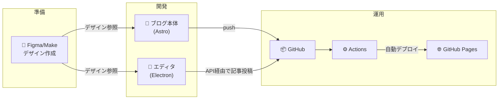
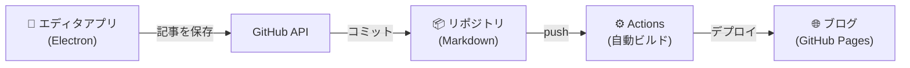

:::note
この記事はホモサピエンスが執筆しています
:::
# はじめに
こんにちは、某JTCに勤めているひよっこMLエンジニアのNeUです。
本記事ではエンジニアなら誰もが一度は憧れるアレの作り方についてお話しします。そう、個人ブログです。

### エンジニアの個人ブログってなんだかカッコよくないですか？
ひよっこエンジニアとしては、カッチョイイ個人ブログ持ってるだけで、なんだか仕事人という感じがして、全員つよつよエンジニアに見えます。

いつの日か、自分もつよつよエンジニアになって、個人ブログを公開した日にはメールボックスは常にヘッドハンティングの連絡で埋め尽くされる。なんて、つい考えてしまいますよね。
~~お前だけだよ~~

冗談はさておき、世は大転職時代です。転職においては「これまで何をやってきたか」ということが重要視されます。
特に、我々エンジニアは顕著に成果物が目に見える職種です。そのため、良くも悪くも、何を残してきたかで、有利不利が大きく左右されます。

ポートフォリオの良し悪しはもちろんですが、そもそもポートフォリオが無ければ話にすらなりません。

そんなわけで
### 欲しくないですか、個人ブログ
作りましょう。

とはいえ、ブログといえばサーバーやらなんやらでコストがかかる。そんなイメージがあると思います。しかし、今回の手法はコスト全振り。なんと、公開から維持まで無料でできちゃいます。

さらに、今回はローカル環境で動くエディタも自作します。githubのapiを使うことでから記事を作成・編集することが可能です。


つまり、今回は2つのアプリを作ります。

1. ブログ本体 (Astro): 読者が見るWebサイト。表示が爆速なのが特徴。
2. 専用エディタ (Electron): 執筆者が使うアプリ。自分のPCで動くWordのようなものですが、保存ボタンを押すと自動でGitHubに記事を送ってくれる優れものです。


今回私が作った個人ブログはこんな感じです。
https://neu-dev.net/
# 仕組み
今回使用するツールは以下の三つです
* Figma
* claude code (gemini cliなど、なんでも可)
* github pages 

FigmaはWebブラウザで使えるデザインツールです。Webサイト・アプリのデザインなどの　UI/UXデザインをするのに使われるツールです。有料会員もありますが、個人ブログ１つ作るくらいでしたら無料会員でも十分可能です。ありがとうFigma

GitHub PagesはGitHubが提供する無料の静的サイトホスティングサービスです。
GitHubのリポジトリに置いたHTML/CSS/JSファイルを、そのままWebサイトとして公開できる機能です。
無料でいいんですか...ありがとうgithub

そして全体の流れは以下の様に進めて行きます。開発から運用まで、APIの設定以外は、claude codeにぶん投げました。筆者は、もはやgit commitさえ面倒でclaude codeで行ってます、大丈夫でしょうか。

# デザイン作成
今回はwebデザイナー御用達ツールfigmaの生成AI版を使ってデザインを作っていきます。

figma make
https://www.figma.com/ja-jp/make/

開くと初っ端から見慣れた、The生成AIなUIが現れます。
ここに、今回は超雑に個人ブログを使う様に指示します。

すると、数分待っている間になんか良い感じのデザインが出来上がります。
さすが天下のfigma様それっぽい。


ちなみに2025年12月現在、figma makeのAIモデルにはsonet4.5が使われているそうです。無料で使って良いんですか...
なお無料版のクレジットは結構渋いのでパパッと作り上げてしまいましょう！

作りたいデザインのモックを作ったらコードをダウンロードしておきましょう。画面上部のコードタブを押して、右上の共有の下のダウンロードボタンをクリックするとzip形式で必要なコードがダウンロードされます。


# 開発
では、ここからは実際に作ったモックを形にしていきます。
作るものは２つです。github pagesで公開する実際のブログと記事の執筆や投稿を行うエディタです。

開発フォルダの構成は以下のように分けました。

📂 my-blog-project/ ├── 📂 blog-astro/ (GitHubにPushして公開)
　　　　　　　　　└── 📂 blog-editor/ (ローカルで使う、誤って公開しない！)」
       　　　　　　　　　└── 📂 解凍したモックデザインのディレクトリ
                
ここからはclaude codeなどのツールを使って行います。
まず、新しいディレクトリを作成し、先ほどダウンロードしたzipを解凍して配置しましょう。
そして、claude codeを起動してプロンプトを打ちます。

```
  GitHub Pages + GitHub Actionsベースのブログシステムと、
  記事を投稿・編集するローカルエディタアプリを構築してください。

  【前提】
  - デザインモック: [モックディレクトリのパスを記入してください]
  - ブログ: Astro + GitHub Pages
  - エディタ: Electron デスクトップアプリ
  - 記事形式: Markdown

  【ブログ側】
  1. モックのデザインを忠実に再現
  2. src/content/配下のMarkdownで記事管理
  3. GitHub Actionsで自動ビルド・デプロイ
  4. ブログのルートディレクトリに `.github/workflows/deploy.yml` を作成してください

  【エディタアプリ側】
  1. Markdownエディタ（プレビュー付き）
  2. 記事一覧の表示・編集・削除
  3. GitHub API経由でリポジトリに直接コミット
  4. 画像アップロード対応
  5. frontmatter（タイトル、日付、タグ等）の入力UI

  まずブログのモックを確認してコンポーネント設計を行い、
  その後エディタアプリの実装に進んでください。

```
すると、ブログが出来上がるのはもちろんですが、更新しやすい様な新しいブログを描くためのエディタも作ってくれます。
私の場合多少変更しましたが、以下の様なエディタが出来上がりました。


# 運用
では、実際に作成したブログとエディタを運用してみましょう。
まずはgithub pagesに作ったブログをアップロードして公開します。

githubで新規のリポジトリを作成して、ブログのディレクトリをcommitしましょう。この時、エディタのディレクトリをアップロードしない様に気をつけましょう。

よくわからない時は、claudeにどのディレクトリをcommitすれば良いか聞いてみましょう。もしくは、リポジトリのURLをclaude codeに渡してcommit代行してもらうのも一つの手です。

commitが終わったら実際にデプロイしてみましょう

Pagesの設定からSourceを選ぶ必要がありますが、ここではActionを設定しておきましょう。

これでデプロイの設定は完了です。しばらくして、Pagesの設定画面をリロードするとURLが発行されます。

続いて作ったローカルのエディタから、記事の更新をできる様にします。

記事の更新は以下の仕組みで行われます。


つまり、エディタアプリでGithub APIを叩く必要があります。そのためGithub APIの設定をします。

Github → Settings → Developer Settings → Personal access tokens (classic)
から新規トークンを発行します。

発行したトークンをclaude codeが指定した方法で渡します。多くの場合、.env というファイルが勝手に作られているため、そこに記入する。もしくは、エディタのアプリ内に設定画面があり、そこに入力することで設定できることが多いです。

この設定を行う実際にローカルのアプリからブログが編集できる様になります。

以上で完成です。エディタから実際に編集ができるか確認してみましょう。

⚠️ 注意: .envファイルには秘密鍵が含まれるため、絶対にGitHubにアップロードしないでください。.gitignoreファイルに.envが記述されていることを必ず確認しましょう。

# おわりに
いざブログを作ったものの、SEO対策やGoogle Analyticsの設定など、やることはまだまだ沢山あることに気づきました。

個人ブログって沼が深い！！でも楽しい！！

最後までお読み頂き、ありがとうございました。この記事が少しでも、あなたのエンジニア人生に彩を添えることができれば幸いです。

ではまた。
